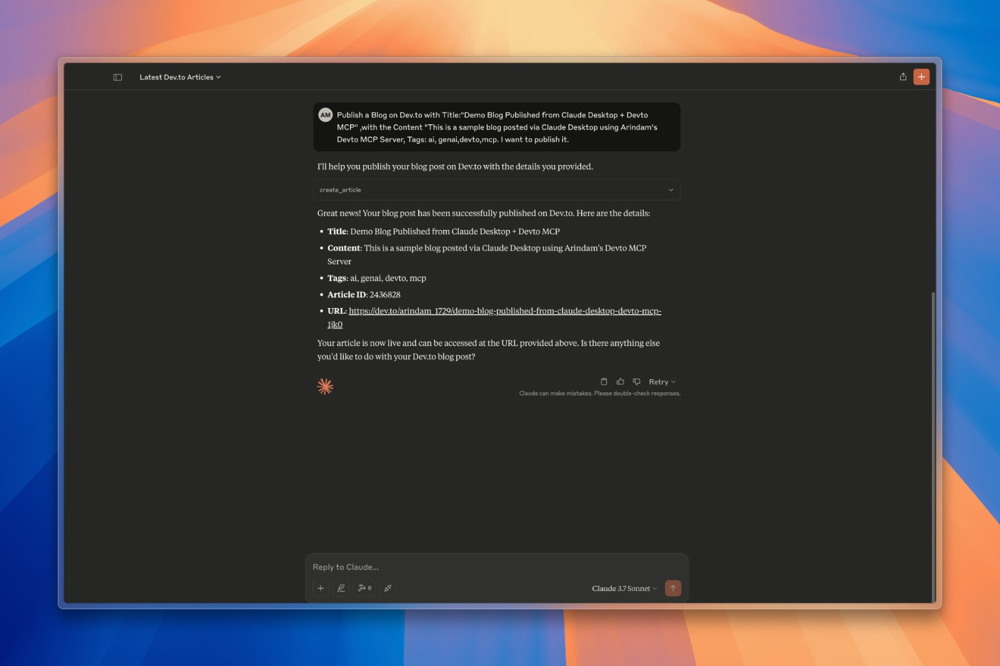

# Dev.to MCP Server

This repository contains a Model Context Protocol server implementation for Dev.to that allows AI assistants to access and interact with Dev.to content.



## What is MCP?

The Model Context Protocol (MCP) is a standard for enabling AI assistants to interface with external services, tools, and data sources. This server implements the MCP specification to provide access to Dev.to content. To know more about MCP, Check this [video](https://www.youtube.com/watch?v=BwB1Jcw8Z-8)

## Features

- Fetch latest and trending articles from Dev.to
- Search for articles by various criteria
- Get detailed information about specific articles
- Access articles by tag or username
- Create and publish new articles to Dev.to
- Update existing articles
- Caching mechanism to improve performance and reduce API calls

## Installation

1. Clone this repository
```bash
git clone https://github.com/Arindam200/devto-mcp.git
cd devto-mcp
```

2. **Connect to the MCP server**

   Copy the below json with the appropriate {{PATH}} values:

   ```json
   {
    "mcpServers": {
      "devto": {
        "command": "{{PATH_TO_UV}}", // Run `which uv` and place the output here
        "args": [
                  "--directory",
                  "{{PATH_TO_SRC}}",// cd into the repo, run `pwd` and enter the output here
                  "run",
                  "server.py"
        ],
        "env": {
          "DEV_TO_API_KEY":"Your Dev.to API Key" // Get it from https://dev.to/settings/extensions.
        }
      }
    }
   }
   ```
   You can obtain a Dev.to API key from your [Dev.to settings page](https://dev.to/settings/extensions).

   For **Claude**, save this as `claude_desktop_config.json` in your Claude Desktop configuration directory at:

   ```
   ~/Library/Application Support/Claude/claude_desktop_config.json
   ```

   For **Cursor**, save this as `mcp.json` in your Cursor configuration directory at:

   ```
   ~/.cursor/mcp.json
   ```

4. **Restart Claude Desktop / Cursor**

   Open Claude Desktop and you should now see WhatsApp as an available integration.

   Or restart Cursor.

### Available Tools

The server provides the following tools:

- `get_latest_articles()` - Get the latest articles from Dev.to
- `get_top_articles()` - Get the most popular articles from Dev.to
- `get_articles_by_tag(tag)` - Get articles by tag
- `get_article_by_id(id)` - Get a specific article by ID
- `search_articles(query, page=1)` - Search for articles by keywords in title/description
- `get_article_details(article_id)` - Get full content and metadata for a specific article
- `get_articles_by_username(username)` - Get articles written by a specific author
- `create_article(title, body_markdown, tags, published)` - Create and publish a new article
- `update_article(article_id, title, body_markdown, tags, published)` - Update an existing article

## Example Queries

Here are some examples of what you can ask an AI assistant connected to this server:

- "Find articles about Python on Dev.to"
- "Show me the latest Dev.to articles"
- "Get details for article 1234"
- "What articles has user 'ben' written?"
- "Search for articles about machine learning"
- "Create a new article titled 'Getting Started with Python'"
- "Update my article with ID 5678 to fix a typo in the content"

## Advanced Features


### Custom Prompts

The server provides pre-defined prompts that can be used by AI assistants:

- `search_prompt` - Create a formatted search prompt
- `analyze_article` - Create a prompt to analyze a specific article

## Authentication

The server requires a Dev.to API key for certain operations, particularly for creating and updating articles. The API key should be set as an environment variable `DEV_TO_API_KEY`.

## Contributing

Contributions are welcome! Please feel free to submit a Pull Request.

## License

This project is licensed under the MIT License - see the LICENSE file for details.
